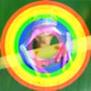
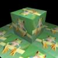
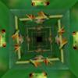
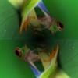

# glsl-test
Test of GLSL

|No  |Screenshot                    |Example                                                          |
|:--:|:----------------------------:|:---------------------------------------------------------------:|
|  1 ||[Link](https://cx20.github.io/glsl-test/examples/001/index.html) |
|  2 ||[Link](https://cx20.github.io/glsl-test/examples/002/index.html) |
|  3 ||[Link](https://cx20.github.io/glsl-test/examples/003/index.html) |
|  4 ||[Link](https://cx20.github.io/glsl-test/examples/004/index.html) |
|  5 ||[Link](https://cx20.github.io/glsl-test/examples/005/index.html) |
|  6 ||[Link](https://cx20.github.io/glsl-test/examples/006/index.html) |
|  7 ||[Link](https://cx20.github.io/glsl-test/examples/007/index.html) |
|  8 ||[Link](https://cx20.github.io/glsl-test/examples/008/index.html) |
|  9 ||[Link](https://cx20.github.io/glsl-test/examples/009/index.html) |
| 10 ||[Link](https://cx20.github.io/glsl-test/examples/010/index.html) |
| 11 ||[Link](https://cx20.github.io/glsl-test/examples/011/index.html) |
| 12 ||[Link](https://cx20.github.io/glsl-test/examples/012/index.html) |
| 13 ||[Link](https://cx20.github.io/glsl-test/examples/013/index.html) |
| 14 ||[Link](https://cx20.github.io/glsl-test/examples/014/index.html) |
| 15 ||[Link](https://cx20.github.io/glsl-test/examples/015/index.html) |
| 16 ||[Link](https://cx20.github.io/glsl-test/examples/016/index.html) |
| 17 ||[Link](https://cx20.github.io/glsl-test/examples/017/index.html) |
| 18 ||[Link](https://cx20.github.io/glsl-test/examples/018/index.html) |
| 19 ||[Link](https://cx20.github.io/glsl-test/examples/019/index.html) |
| 20 ||[Link](https://cx20.github.io/glsl-test/examples/020/index.html) |
| 21 ||[Link](https://cx20.github.io/glsl-test/examples/021/index.html) |
| 22 ||[Link](https://cx20.github.io/glsl-test/examples/022/index.html) |
| 23 ||[Link](https://cx20.github.io/glsl-test/examples/023/index.html) |
| 24 ||[Link](https://cx20.github.io/glsl-test/examples/024/index.html) |
| 25 ||[Link](https://cx20.github.io/glsl-test/examples/025/index.html) |
| 26 ||[Link](https://cx20.github.io/glsl-test/examples/026/index.html) |
| 27 ||[Link](https://cx20.github.io/glsl-test/examples/027/index.html) |
| 28 ||[Link](https://cx20.github.io/glsl-test/examples/028/index.html) |
| 29 ||[Link](https://cx20.github.io/glsl-test/examples/029/index.html) |
| 30 ||[Link](https://cx20.github.io/glsl-test/examples/030/index.html) |
| 31 ||[Link](https://cx20.github.io/glsl-test/examples/031/index.html) |
| 32 ||[Link](https://cx20.github.io/glsl-test/examples/032/index.html) |
| 33 ||[Link](https://cx20.github.io/glsl-test/examples/033/index.html) |
| 34 ||[Link](https://cx20.github.io/glsl-test/examples/034/index.html) |
| 35 ||[Link](https://cx20.github.io/glsl-test/examples/035/index.html) |
| 36 ||[Link](https://cx20.github.io/glsl-test/examples/036/index.html) |
| 37 ||[Link](https://cx20.github.io/glsl-test/examples/037/index.html) |
| 38 ||[Link](https://cx20.github.io/glsl-test/examples/038/index.html) |
| 39 ||[Link](https://cx20.github.io/glsl-test/examples/039/index.html) |
| 40 ||[Link](https://cx20.github.io/glsl-test/examples/040/index.html) |
| 41 ||[Link](https://cx20.github.io/glsl-test/examples/041/index.html) |
| 42 ||[Link](https://cx20.github.io/glsl-test/examples/042/index.html) |
| 43 ||[Link](https://cx20.github.io/glsl-test/examples/043/index.html) |
| 44 ||[Link](https://cx20.github.io/glsl-test/examples/044/index.html) |
| 45 ||[Link](https://cx20.github.io/glsl-test/examples/045/index.html) |
| 46 ||[Link](https://cx20.github.io/glsl-test/examples/046/index.html) |
| 47 ||[Link](https://cx20.github.io/glsl-test/examples/047/index.html) |
| 48 ||[Link](https://cx20.github.io/glsl-test/examples/048/index.html) |
| 49 ||[Link](https://cx20.github.io/glsl-test/examples/049/index.html) |
| 50 ||[Link](https://cx20.github.io/glsl-test/examples/050/index.html) |
| 51 ||[Link](https://cx20.github.io/glsl-test/examples/051/index.html) |
| 52 ||[Link](https://cx20.github.io/glsl-test/examples/052/index.html) |
