# glsl-test
Test of GLSL

|No  |Screenshot                    |Zoom                               |Example                                                          |Original or reference URL                                       |
|:--:|:----------------------------:|:---------------------------------:|:---------------------------------------------------------------:|:---------------------------------------------------------------|
|  1 |||[Link](https://cx20.github.io/glsl-test/examples/001/index.html) |http://jsdo.it/cx20/3yw3 |
|  2 |||[Link](https://cx20.github.io/glsl-test/examples/002/index.html) |https://www.shadertoy.com/view/XsfGDl |
|  3 |||[Link](https://cx20.github.io/glsl-test/examples/003/index.html) |https://www.shadertoy.com/view/4d2Xzy |
|  4 |||[Link](https://cx20.github.io/glsl-test/examples/004/index.html) |https://www.shadertoy.com/view/MdsXRB |
|  5 |||[Link](https://cx20.github.io/glsl-test/examples/005/index.html) |https://www.shadertoy.com/view/XslGRM |
|  6 |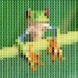||[Link](https://cx20.github.io/glsl-test/examples/006/index.html) |https://www.shadertoy.com/view/MssSDl |
|  7 ||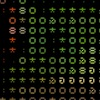|[Link](https://cx20.github.io/glsl-test/examples/007/index.html) |https://www.shadertoy.com/view/lssGDj |
|  8 |||[Link](https://cx20.github.io/glsl-test/examples/008/index.html) |https://www.shadertoy.com/view/Mdf3Dn |
|  9 |||[Link](https://cx20.github.io/glsl-test/examples/009/index.html) |https://www.shadertoy.com/view/4dS3D1 |
| 10 |||[Link](https://cx20.github.io/glsl-test/examples/010/index.html) |https://www.shadertoy.com/view/ls23Dc |
| 11 |||[Link](https://cx20.github.io/glsl-test/examples/011/index.html) |https://www.shadertoy.com/view/MdX3Dr |
| 12 |||[Link](https://cx20.github.io/glsl-test/examples/012/index.html) |https://github.com/tacoe/detroit/blob/master/arthur/scanlines.glsl |
| 13 |||[Link](https://cx20.github.io/glsl-test/examples/013/index.html) |https://qiita.com/edo_m18/items/85d5c0ca5bdf0ed159e4 |
| 14 |||[Link](https://cx20.github.io/glsl-test/examples/014/index.html) | |
| 15 |||[Link](https://cx20.github.io/glsl-test/examples/015/index.html) |http://d-kami.net/shader/mono.html |
| 16 |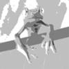||[Link](https://cx20.github.io/glsl-test/examples/016/index.html) | |
| 17 |||[Link](https://cx20.github.io/glsl-test/examples/017/index.html) |https://wgld.org/d/webgl/w053.html |
| 18 |||[Link](https://cx20.github.io/glsl-test/examples/018/index.html) |https://wgld.org/d/webgl/w066.html |
| 19 |||[Link](https://cx20.github.io/glsl-test/examples/019/index.html) |https://qiita.com/edo_m18/items/d166653ac0dccbc607dc |
| 20 |||[Link](https://cx20.github.io/glsl-test/examples/020/index.html) |http://filters.kayac.com/ |
| 21 |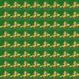||[Link](https://cx20.github.io/glsl-test/examples/021/index.html) | |
| 22 |||[Link](https://cx20.github.io/glsl-test/examples/022/index.html) |https://wgld.org/d/webgl/w067.html |
| 23 |||[Link](https://cx20.github.io/glsl-test/examples/023/index.html) |http://jsdo.it/calmbooks/GLSLMangaEffectLine |
| 24 |||[Link](https://cx20.github.io/glsl-test/examples/024/index.html) | |
| 25 |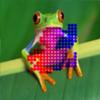||[Link](https://cx20.github.io/glsl-test/examples/025/index.html) | |
| 26 |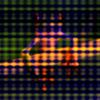||[Link](https://cx20.github.io/glsl-test/examples/026/index.html) |http://glslsandbox.com/e |
| 27 |||[Link](https://cx20.github.io/glsl-test/examples/027/index.html) |http://glslsandbox.com/e#21489.2 |
| 28 |||[Link](https://cx20.github.io/glsl-test/examples/028/index.html) |http://glslsandbox.com/e#21497.0 |
| 29 |||[Link](https://cx20.github.io/glsl-test/examples/029/index.html) |http://glslsandbox.com/e#13195.0 |
| 30 |||[Link](https://cx20.github.io/glsl-test/examples/030/index.html) |https://www.shadertoy.com/view/lsBSDm |
| 31 |||[Link](https://cx20.github.io/glsl-test/examples/031/index.html) |https://www.shadertoy.com/view/XdlGzn |
| 32 |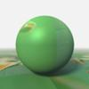||[Link](https://cx20.github.io/glsl-test/examples/032/index.html) |https://www.shadertoy.com/view/ldSGzR |
| 33 |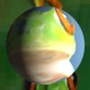||[Link](https://cx20.github.io/glsl-test/examples/033/index.html) |https://www.shadertoy.com/view/4sf3Rn |
| 34 |||[Link](https://cx20.github.io/glsl-test/examples/034/index.html) |https://www.shadertoy.com/view/Ms2SWW |
| 35 |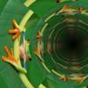||[Link](https://cx20.github.io/glsl-test/examples/035/index.html) |https://www.shadertoy.com/view/XssGDr |
| 36 |||[Link](https://cx20.github.io/glsl-test/examples/036/index.html) |https://www.shadertoy.com/view/MdjSDW |
| 37 |||[Link](https://cx20.github.io/glsl-test/examples/037/index.html) |https://www.shadertoy.com/view/XsX3Rn |
| 38 |||[Link](https://cx20.github.io/glsl-test/examples/038/index.html) |https://www.shadertoy.com/view/lsBXz3 |
| 39 |||[Link](https://cx20.github.io/glsl-test/examples/039/index.html) |https://www.shadertoy.com/view/4dfXDS |
| 40 |||[Link](https://cx20.github.io/glsl-test/examples/040/index.html) | |
| 41 |||[Link](https://cx20.github.io/glsl-test/examples/041/index.html) |https://www.shadertoy.com/view/4sS3Dw |
| 42 |||[Link](https://cx20.github.io/glsl-test/examples/042/index.html) | |
| 43 ||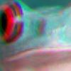|[Link](https://cx20.github.io/glsl-test/examples/043/index.html) |https://qiita.com/uriuriuriu/items/7be0ed117ab8ae3e7f79 |
| 44 |||[Link](https://cx20.github.io/glsl-test/examples/044/index.html) |http://filters.kayac.com/ |
| 45 ||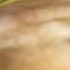|[Link](https://cx20.github.io/glsl-test/examples/045/index.html) |https://www.shadertoy.com/view/ldsSDn |
| 46 |||[Link](https://cx20.github.io/glsl-test/examples/046/index.html) |http://filters.kayac.com/ |
| 47 |||[Link](https://cx20.github.io/glsl-test/examples/047/index.html) | |
| 48 |||[Link](https://cx20.github.io/glsl-test/examples/048/index.html) |https://github.com/mrdoob/three.js/blob/master/examples/js/shaders/FilmShader.js |
| 49 |||[Link](https://cx20.github.io/glsl-test/examples/049/index.html) |https://github.com/mrdoob/three.js/blob/master/examples/js/shaders/DotScreenShader.js |
| 50 |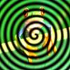||[Link](https://cx20.github.io/glsl-test/examples/050/index.html) |http://jsdo.it/calmbooks/GruGruEffect |
| 51 |||[Link](https://cx20.github.io/glsl-test/examples/051/index.html) |http://jsdo.it/calmbooks/GLSLMangaEffectLine |
| 52 |||[Link](https://cx20.github.io/glsl-test/examples/052/index.html) |https://ics.media/entry/5535/ |
